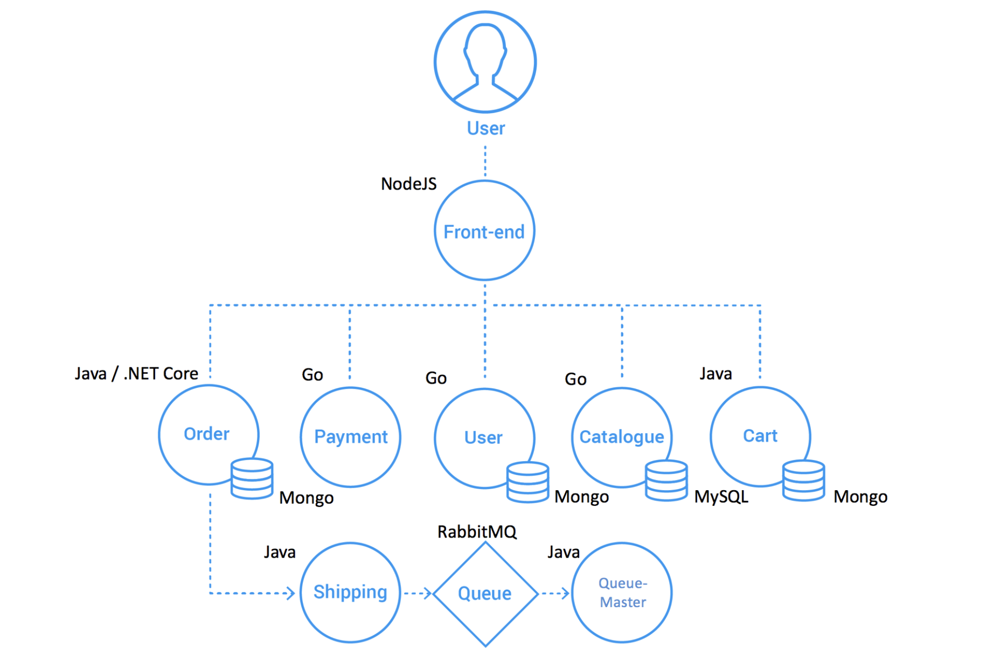
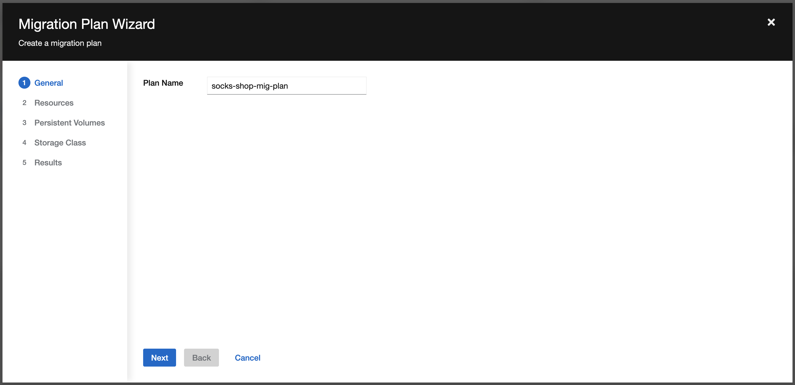
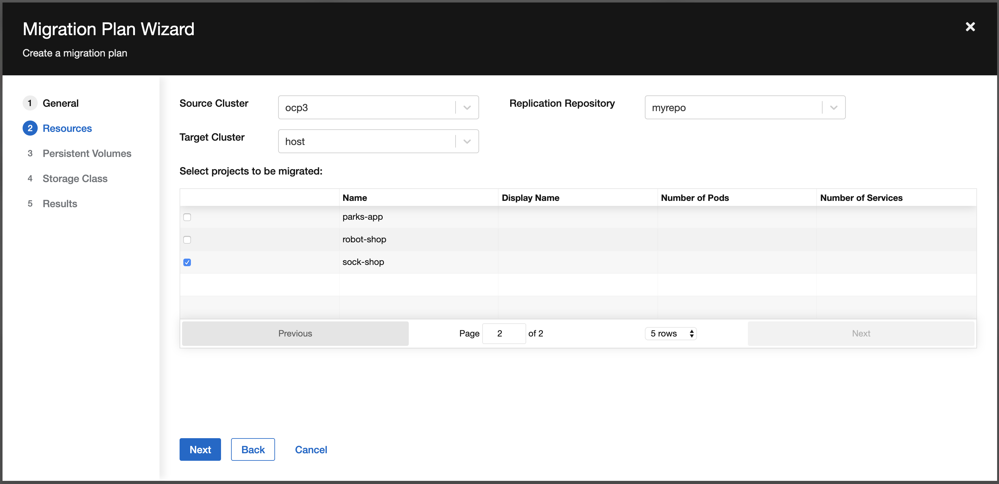
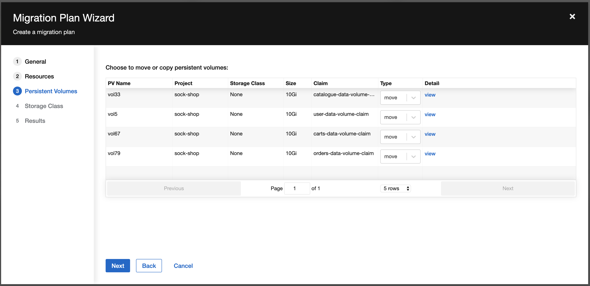
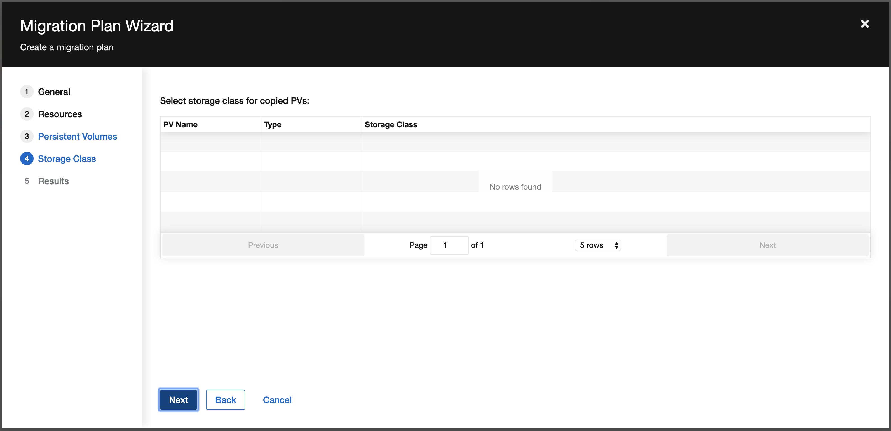
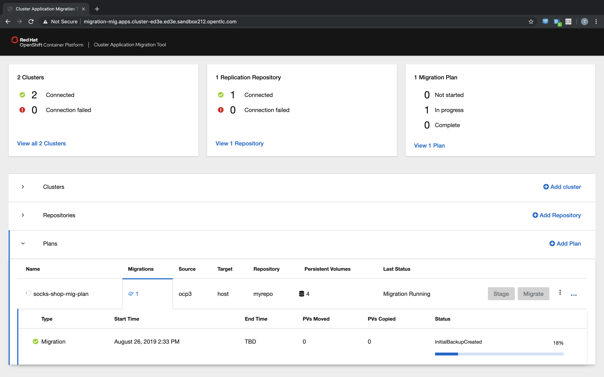
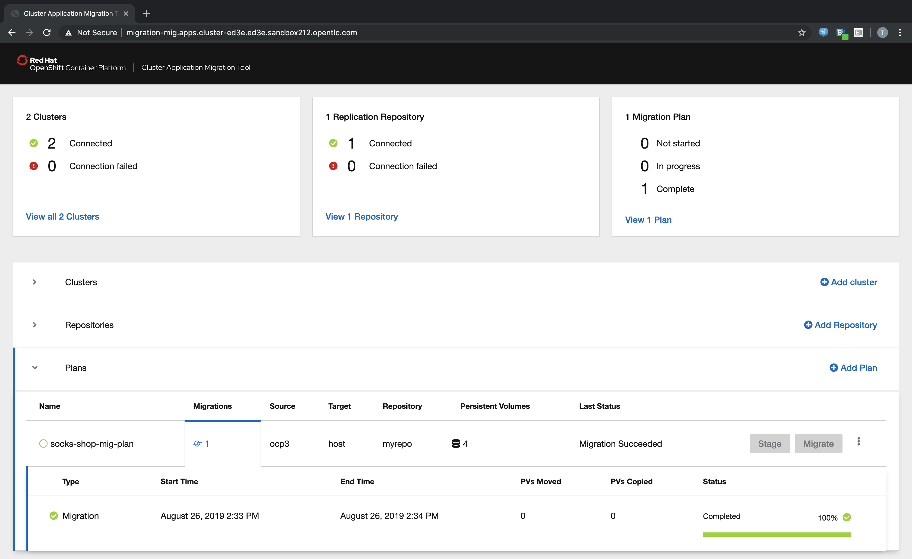
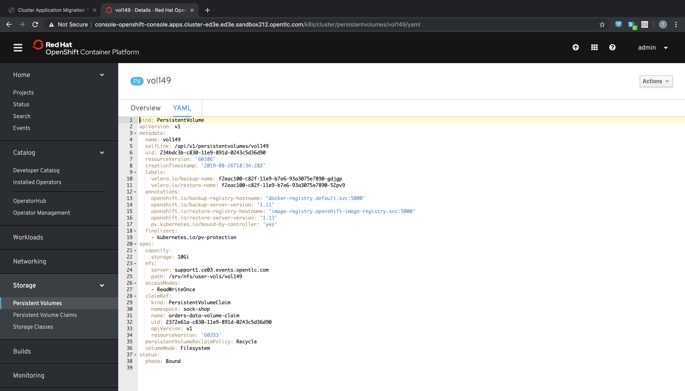

# 4.0 Migrate Sock-Shop Application

In this lab we are going to migrate Weaveworks' Production Internet Store, the Sock Shop.  This store is has lots of traffic daily, and Weaveworks is very concerned about minimizing any downtime/unavailability of the store. Weaveworks is very interested in moving this workload over to a larger cluster to make room for more experimental sock apps on their current cluster.

## 4.1 Application Architecture

The architecture of the Sock Shop application was intentionally designed to provide as many micro-services as possible. As seen in the image below, the micro-services are roughly defined by the function in an ECommerce site.  Networks are specified, but due to technology limitations may not be implemented in some deployments.  All services communicate using REST over HTTP.



## 4.1.1 Deploying the Sock Shop app to the _Source Cluster_
Login to the _source cluster_ and deploy the Sock Shop app.

```bash
$ oc create -f https://raw.githubusercontent.com/fusor/mig-demo-apps/master/apps/sock-shop/manifest.yaml
```

_Required Images - Sock Shop_
```bash
docker.io/redis:alpine
docker.io/mongo
docker.io/rabbitmq:3.6.8-management
docker.io/kbudde/rabbitmq-exporter
docker.io/weaveworksdemos/carts:0.4.8
docker.io/weaveworksdemos/catalogue:0.3.5
docker.io/weaveworksdemos/front-end:0.3.12
docker.io/weaveworksdemos/orders:0.4.7
docker.io/weaveworksdemos/payment:0.4.3
docker.io/weaveworksdemos/queue-master:0.3.1
docker.io/weaveworksdemos/shipping:0.4.8
docker.io/weaveworksdemos/user:0.4.7
docker.io/weaveworksdemos/user-db:0.3.0
```

After creation, you should see the following set of Pods.

```bash
$ oc get pods -n sock-shop
NAME                            READY     STATUS    RESTARTS   AGE
carts-77555f7648-sdx48          1/1       Running   0          3h
carts-db-74db84c448-lv8sk       1/1       Running   0          3h
catalogue-b5fc87544-cvhb8       1/1       Running   0          3h
catalogue-db-1-c2f4w            1/1       Running   0          3h
front-end-5c49687b5c-qgzkj      1/1       Running   0          3h
orders-56b86d7dd7-gsnxh         1/1       Running   0          3h
orders-db-7645cb4d78-pmg8s      1/1       Running   0          3h
payment-685fdbcf67-4kgzn        1/1       Running   0          3h
queue-master-58bcb789cd-thq9v   1/1       Running   0          3h
rabbitmq-798d7b5976-7mgdl       2/2       Running   0          3h
session-db-7cc8ddc4cc-pxvmw     1/1       Running   0          3h
shipping-5ccdd4b459-dsvxf       1/1       Running   0          3h
user-5648777687-2zkgs           1/1       Running   0          3h
user-db-b655656b7-48qzs         1/1       Running   0          3h
```

Let's get the route to the application, and bring up the webUI.

```bash
$  oc get route -n sock-shop
NAME        HOST/PORT                                 PATH          
front-end   front-end-sock-shop.apps.srccluster.com   /      
```


## 4.2 Migration planning

### 4.2.1 Create Sock Shop Security Context Constraint

The custom SCC yaml is available [here](./files/sock-shop-scc.yaml).  Please download to your local machine, as we will apply it in the next step.

1. Run the following to recreate Sock Shop's `scc` on the _destination cluster_:
```bash
$ oc create -f sock-shop-scc.yaml
securitycontextconstraints.security.openshift.io/sock-shop created
```

## 4.3 Using CAM

Next, let's open up the migration UI. Again, to get the route, run the following command on the _destination_ cluster:
```bash
$ oc get routes migration -n mig -o jsonpath='{.spec.host}'
 migration-mig.apps.destcluster.com
```

Since we already have our _source cluster_, target cluster, & replication repository defined; we can move right to creating a migration plan.  Click `Add Plan`:



Fill out a plan name. Click Next.



Select the _source_ and _destination_ cluster, the replication repository, and the `sock-shop` namespace (which we want to migrate over). Click Next.



Now we are displayed the list of persistent volumes associated with our application workload. Select which type of action you would like to perform on each PV.  Since, minimizing downtime is very important in this example, and both of our clusters have access to the NFS shared storage, let's select `move` for each PV.  ***Move will re-map the PVs from the source cluster to target cluster, so it's the fastest option for handling state.***  Click Next.



Since all our PVs are being `moved`, so destination storage classes need to be specified.  Click Next.


After validating the migration plan, you will see a `Ready` message and you can click `Close`.


### 4.3.1 Migrate the Application Workload

Now we can select `Migrate` or `Stage` on the application. Since we have chosen to `move` our four PVs, we will click on `Migrate`.  *Stage will skip any PVs not using copy.*


Optionally choose to *not* terminate the application on the _source cluster_.
Leave it unchecked and select `Migrate`.


The migration will progress with a progress bar showing each step in the process.



Once done, you should see `Migration Succeeded` on the migration plan.




### 4.3.2 Verify application is functioning on _Destination Cluster_

Let's check out the Pods running in the 'sock-shop' namespace on the _destination cluster_.
```bash
$ oc get pods -n sock-shop
NAME                            READY     STATUS    RESTARTS   AGE
carts-77555f7648-sdx48          1/1       Running   0          5m
carts-db-74db84c448-lv8sk       1/1       Running   0          5m
catalogue-b5fc87544-cvhb8       1/1       Running   0          5m
catalogue-db-1-c2f4w            1/1       Running   0          5m
front-end-5c49687b5c-qgzkj      1/1       Running   0          5m
orders-56b86d7dd7-gsnxh         1/1       Running   0          5m
orders-db-7645cb4d78-pmg8s      1/1       Running   0          5m
payment-685fdbcf67-4kgzn        1/1       Running   0          5m
queue-master-58bcb789cd-thq9v   1/1       Running   0          5m
rabbitmq-798d7b5976-7mgdl       2/2       Running   0          5m
session-db-7cc8ddc4cc-pxvmw     1/1       Running   0          5m
shipping-5ccdd4b459-dsvxf       1/1       Running   0          5m
user-5648777687-2zkgs           1/1       Running   0          5m
user-db-b655656b7-48qzs         1/1       Running   0          5m
```

Using the 'oc' CLI again, let's check out the Persistent Volume Claims in the 'sock-shop' namespace on the _destination cluster_.
```bash
$ oc get pvc -o yaml -n sock-shop
```

Examining the YAML output of the last command, we can verify that the underlying storage is the NFS server instance running on our _source cluster_.  This confirms that our PVs were indeed remapped via `move`.




**Great job**, you have now successfully migrated two applications to your target cluster!

However, what happens when things don't go as planned?  In the next lab, we will examine some techniques for debugging failed migrations.

Next Section: [Section 5 - Debugging Failed Migrations](./5.md)<br>
Previous Section: [Section 3 - Migrate MSSQL Application](./3.md)<br>
[Home](./README.md)
